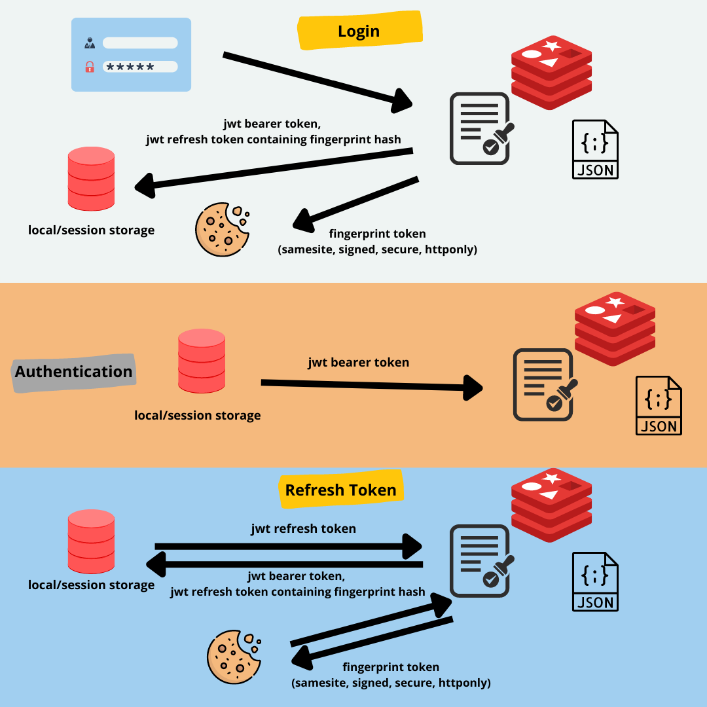

<h3 align="center">Most Secure Authentication</h3>

---

<p align="center"> Working demo of how to implement a secure authentication service
    <br> 
</p>

# 📝 Table of Contents

- [About](#about)
- [Getting Started](#getting_started)
- [Usage](#usage)

# 🧐 About <a name = "about"></a>

This project demonstrates a fully working application comprising of a **backend (a graphql api server built with NestJs)** and a **frontend (built with NextJs)**. Through this project, you may find reference on developing a backend that utilizes **httponly, samesite, secure and signed fingerprint cookie alongside refresh token/bearer token mechanism and session tracking using redis** to be as secure as possible. You can also find reference on how to develop a graphql api server. You may learn how to implement **silent refresh strategy using apollo client**. This project also includes **unit, integration and end-to-end testing using jest and docker**. And as a bonus, you will find a tip on that database, if you can successfully follow the instructions below.

## Background

Authentication is one of the integral parts of most applications. As it is the way to protect sensitive data of our business/users and performable actions on the assets, it must be as secure as possible. On top of that, making the authentication stateless is another desirable property of modern applications. 
Hence the JWT was born which enables us to obtain a secure yet stateless authentication process. But still, we are extremely vulnerable to CSRF and XSS attacks only because of how poorly we implement them. This project is a demo on how we can maximize the security using **httponly, samesite, secure, and signed fingerprint cookie alongside refresh token/bearer token mechanism and session tracking using redis**.



When a user logins, the backend service will sign two tokens. One is a short-lived (15 minute) bearer token and another is a long-lived (as you may please) refresh token. Also, the system will generate a random fingerprint string, save that on a redis against the current login session window, attach it with the response as a httponly, samesite strict, secure and signed cookie, and return a hash of the fingerprint as the payload of the refresh token. On the frontend, the tokens will be stored on sessionStorage. They can be stored in localStorage as well if persistence logged in on browser restart feature is a must, but that will be less secure. 

Then the bearer token must be added as Authorization header on requests manually to access protected resources. But as soon as the bearer token expires (15 minute), the subsequent requests will be rejected. To access the protected resources again, we have to request a new valid bearer token again from the backend service which should be done through silent token refresh mechanism. We will have to add the refresh token as Authorization header on the refresh token request manually. The backend service will check the presence of the refresh token and fingerprint cookie which will be sent with the request automatically by the browser. If they are present then the server will validate them and check the session against sessions stored on redis. On successful pass of these operations, the server will generate new tokens pair and reset the whole process again. But if any of the steps fail the server will reject the request, destroy the session record from redis (if present), and invalidate the fingerprint cookie (if present).  

As the bearer token will be short-lived, if it gets stolen then the attacker can not use it for much time. And if the refresh token (which is safe from CSRF attacks, XSS attacks as well if sessionStorage is used) is stolen, the attacker can not use it as it needs the fingerprint token (which is safe from CSRF and httponly) to function. Above all of these, we have login sessions stored on redis which we can delete on logout which will invalidate the refresh token immediately.

# 🏁 Getting Started <a name = "getting_started"></a>

These instructions will get you a copy of the project up and running on your local machine for development and testing purposes. See [usage](#usage) for how you can see everything in action.

## Prerequisites

What things you need to run the application

```
node v14.15.4
npm v7.5.3
```
```
docker-compose v1.29.2
```

## Installing

A step by step series of examples that tell you how to get a development env running.

Clone this repository

```
git clone https://github.com/theZeuses/most-secure-auth.git
```

Change working directory

```
cd most-secure-auth
```
### Backend
Change working directory

```
cd graphql-with-nestjs
```
Create a .env file in root and copy everything form .env.example

```
cat .env.example > .env
```

Install the dependencies

```
npm install
```

Spin up the docker services

```
npm run d-service:restart
```
>If you don't want to use docker, rather want to use Postgres and Redis from your localhost, you can skip this step. But in that case, you have to edit _.env_ and _.env.test_ with your Postgres and Redis configuration values. NOTE: .env.test should only contain configurations for test environment

Run the migrations

```
npm run migration:run
```
***Incase of connection lost error please wait for some time and run the command again as Postgres needs some to be fully up***

Run the seeders

```
npm run seeder:run:dev
```
Start the application
```
npm run start:dev
```
### Frontend
Change working directory

```
cd frontend
```
Install the dependencies

```
npm install
```
Start the application
```
npm run start:dev
```

# 🔧 Running the tests <a name = "tests"></a>
## Backend
Make sure your current working directory is _graphql-with-nestjs_
### Set Up
If the docker services aren't running already

```
npm run test:prepare
```
***Incase of connection lost error please wait for some time and run the next command as Postgres needs some to be fully up***

Prepare the test database

```
npm run test:migration:run
```
***Incase of connection lost error please wait for some time and run the command again as Postgres needs some to be fully up***

### Automated Tests
To run all the unit tests run

```
npm start test
```

To run all the integration tests run

```
npm run test:int
```

To run all the end to end test run

```
npm run test:e2e
```

# 🎈 Usage <a name="usage"></a>

As soon as your copy of both backend and frontend boot up you can start exploring

- Navigate to http://localhost:3000 using your favorite browser
- Login using guest as username and password
- Voila 
- You can click the love icon